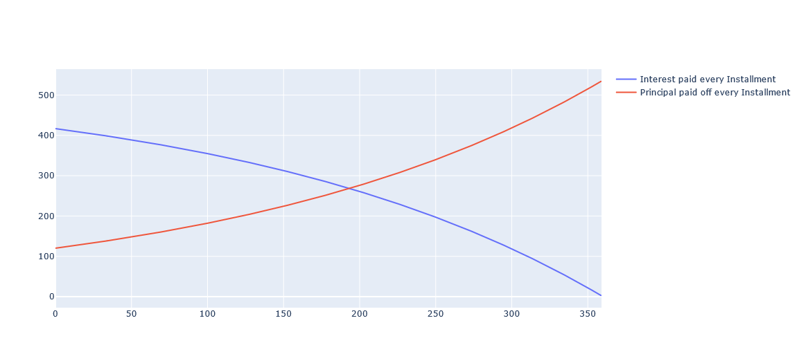
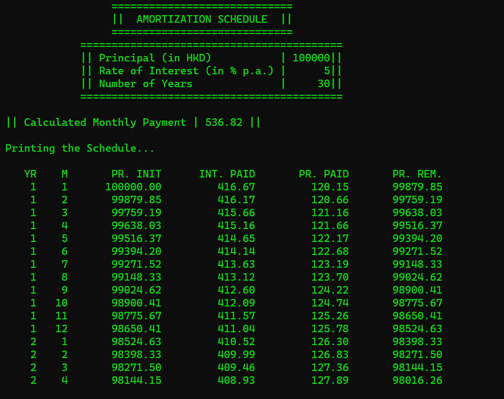
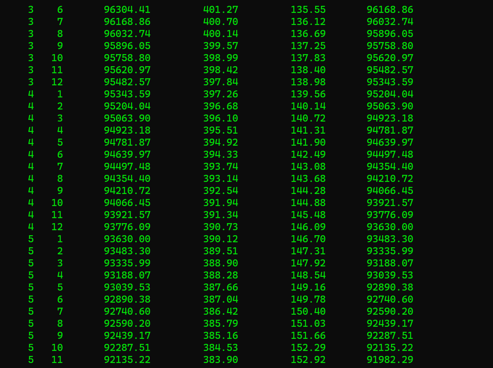
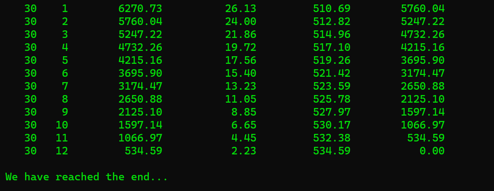

# Amortization Schedule

Created an **Amortization Scheduler** using C++ implementing various Object Oriented conceptualisation along with front end vizualisation using a Python Notebook.

Execute using:

&nbsp;&nbsp;&nbsp;&nbsp;&nbsp;`g++ -pedantic-errors -std=c++11 scheduler.cpp introductionTextGenerator.cpp schedulePrint.cpp -o scheduler`

&nbsp;&nbsp;&nbsp;&nbsp;&nbsp;`./scheduler [PRINCIPAL] [RATE_OF_INTEREST] [NUMBER_OF_YEARS]`

Example:

&nbsp;&nbsp;&nbsp;&nbsp;&nbsp;`./scheduler 100000 5 30`

# Outputs and Viz (BASED ON EXAMPLE):

## ... ##

## ... ##

## ... ##

## ... ##

### ~~ Sankalok Sen ~~ ###
